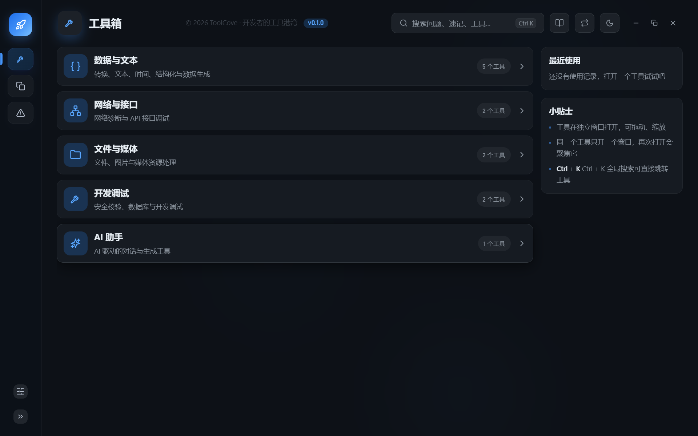

# ToolCove

**A developer's efficiency workbench for Windows — local-first, no account, ready to use.**

ToolCove (工具湾) gathers the small but frequent actions of daily development — formatting,
conversion, encryption, diffing, request debugging, quick notes, issue tracking, and AI
assistance — into one offline-first desktop app.



## Features

- **Toolbox** — 12 built-in tools, each opens in its own draggable/resizable window:

  | Group | Tools |
  |-------|-------|
  | Data & Text | Data conversion (Base64 / URL / Unicode / Hex / JWT / JSON escape), Text processing (diff / regex / replace / line ops / naming / stats), Time & schedule (timestamp / timezone / Cron), Structured data (JSON / YAML validate-format-tree-convert), Data generation (UUID / ULID / NanoID / mock / templates) |
  | Network & API | Network diagnostics (URL / CIDR / DNS / port / ping / route), API debugger (collections & environments) |
  | File & Media | File processing (info / encoding / Base64 / line endings / batch rename), Image processing (convert / compress / resize / colors / icon generator / EXIF) |
  | Dev tools | Crypto & checksum (digest / HMAC / AES / RSA / password generator), Database manager (connect, run SQL, browse tables) |
  | AI | AI chat (multi-session, image input, prompt presets) |

- **Snippets** — quick notes with one-click copy, global search, password masking, and image attachments.
- **Problems** — lightweight issue tracker with local tags, AI-assisted analysis, and team-experience reuse.
- **AI assistance** — bring your own OpenAI-compatible endpoint; model config lives in Settings.

**Privacy first**: everything is stored as local JSON in your app-data directory. No account,
no telemetry, no cloud sync. HTTP requests (including AI) go through a built-in Rust proxy —
the only outbound traffic is what you explicitly trigger.

## Download & Update

- Download the latest installer from [GitHub Releases](https://github.com/GitHub-lcb/ToolCove/releases).
- The app checks for updates on startup and on demand (Settings → Check for updates).
  Updates are signed and verified against the built-in public key before installation.
- The Oracle JDBC driver used by the database tool is distributed separately
  ([tag: drivers](https://github.com/GitHub-lcb/ToolCove/releases/tag/drivers)) and downloaded
  on first use of the database tool.

> Note: downloads from GitHub Releases can be slow in mainland China; a mirror may be provided later.

## Build from source

Requires Node.js ≥ 20 and Rust (MSVC toolchain).

```powershell
npm install
npm run tauri dev     # run the desktop app with hot reload
npm run test          # unit tests (vitest)
npm run build         # frontend build only
cargo check           # Rust checks (in src-tauri/)
```

### Release

Releases are built and published locally (the signing key never leaves your machine):

```powershell
npm run release -- "release notes"   # build, sign, create GitHub Release, upload assets
node scripts/release.js --drivers     # upload oracle-driver.zip to the `drivers` tag (once)
```

> Note: use `node scripts/release.js` directly for flag-style arguments (`--drivers`);
> `npm run release -- --drivers` would swallow the flag as an npm config.

Requires a `GITHUB_TOKEN` environment variable (PAT with `repo` scope).

## Tech stack

Tauri 2 · Vue 3 · Vite · vitest · vue-i18n. No router / state library / UI framework —
plain components, CSS variables for theming, and business logic in pure JS modules covered
by unit tests.

## License

Proprietary. All rights reserved — see [LICENSE](LICENSE). You may download and use the
official releases; redistribution or modification is not permitted without written consent.

---

## 中文简介

ToolCove（工具湾）是面向个人开发者的 Windows 桌面效率工作台，把日常高频的零散开发动作
收拢到一个离线优先的本地应用里。

- **工具箱**：12 个内置工具——数据转换、文本处理、时间调度、结构化数据、数据生成、
  网络诊断、API 调试、文件处理、图片处理、加密与校验、数据库管理、AI 对话，每个工具
  独立窗口，即开即用。
- **速记**：常用数据随手记，一键复制、全局搜索（Ctrl+K）、密码脱敏、图片附件。
- **问题记录**：轻量问题跟踪，本地标签分类，支持 AI 辅助分析与经验复用。
- **AI 辅助**：自带 OpenAI 兼容接口配置，支持多会话对话、识图录入与提示词模板。

**纯本地、无账号、开箱即用**：数据全部存本地 JSON，无遥测、无云同步；外部请求均经
内置 Rust 代理，由你主动触发。

下载安装请前往 [GitHub Releases](https://github.com/GitHub-lcb/ToolCove/releases)，应用
启动时自动检查更新（更新包签名验签后安装）。反馈问题或提建议请通过
[Issues](https://github.com/GitHub-lcb/ToolCove/issues)。
