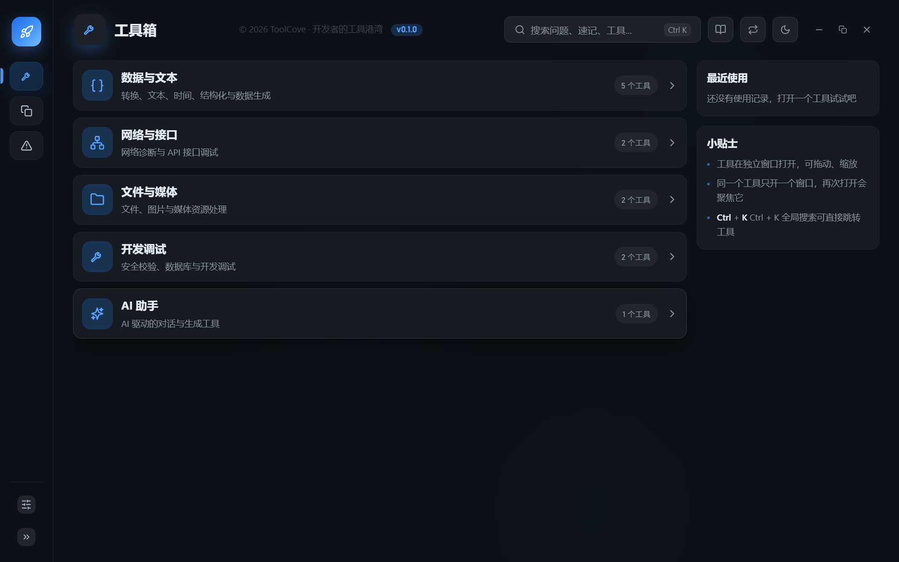

# ToolCove · 工具湾

**An agent-driven developer workbench — local-first, no account, free and open source (MIT).**

ToolCove gathers the small but frequent actions of daily development — formatting, conversion,
encryption, diffing, request debugging, quick notes, issue tracking, and AI assistance — into one
app, with a built-in agent that can drive those tools for you. It runs as a **Windows desktop app**
(Tauri 2) and as a **static web app** in the browser.



## Features

- **Agent workspace** — the default first screen. Describe a goal in natural language; the agent
  plans, calls tools (including file, database, and network tools on the desktop build), shows
  every step live, and asks for confirmation before risky writes. Bring your own OpenAI-compatible
  endpoint; a run log is kept so an interrupted task can be resumed.
- **Toolbox** — 21 built-in tools, each opens in its own draggable/resizable window (the title-bar pin
  keeps a window above all others, so a HUD-style tool can float over a game in borderless mode):

  | Group | Tools |
  |-------|-------|
  | Data & Text | Data conversion (Base64 / URL / Unicode / Hex / JWT / JSON escape), Text processing (regex / replace / line ops / naming / stats), Diff (line & word diff, merge view), Table converter (CSV/TSV ↔ JSON / Markdown / SQL INSERT, clean & reshape), Markdown (outline / TOC / lint / format / HTML preview), Structured data (JSON / YAML validate-format-tree-convert), XML (validate / format / XML↔JSON / XPath), JSON Schema (infer / validate / sample / explain structure), Time & schedule (timestamp / timezone / Cron), Data generation (UUID / ULID / NanoID / mock / templates) |
  | Network & API | Network diagnostics (URL / CIDR / DNS / port / ping / route), API debugger (collections & environments) |
  | File & Media | File processing (info / encoding / Base64 / line endings / batch rename), Image processing (convert / compress / resize / colors / icon generator / EXIF), PDF toolkit (merge / split by range / extract or delete pages / rotate / decrypt), Label printing (TSPL layout, barcode/QR, live 203dpi preview, .prn export) |
  | Dev tools | Crypto & checksum (digest / HMAC / AES / RSA / password generator), Database manager (connect, run SQL, browse tables) |
  | AI | AI chat (multi-session, image input, prompt presets), Auto check-in (scheduled check-in for the daily-credit campaigns of AI agent tools, driven by site descriptors you fill in — see below) |
  | Game helpers | Rail Tycoon route solver (Lord of the Mysteries homestead trade run: enumerates every valid stop layout from the "next 3 stops" hints, locks the next stop and advises which card to take) |
  | Arcade | Interview prep (offline question banks for four interview tracks — backend/Java, algorithms, system design and frontend — where the model answer starts collapsed so you answer first, then rate yourself honestly; your rating drives a spaced-review queue, and every question credits the high-star open-source repository it draws on. 311 built-in questions across 75 topics under a controlled vocabulary, keyword/topic/difficulty/mastery filters, mock-interview sets drawn evenly from all four tracks, a Markdown/JSON importer, and `npm run bank:fetch` — a build script that scrapes any GitHub repository into an importable bank) |

  Network diagnostics, file processing, the database manager and label printing need native capabilities
  and are available in the desktop build only; everything else — including the PDF toolkit, which runs in
  the frontend on pdf-lib (plus qpdf-wasm, lazily fetched only when a file turns out to be
  encrypted) — works in both builds.

  The gallery home has its own search (tool name, capability, or keyword), a quick-access row built
  from your pinned and recently used tools, and collapsible groups whose tools render as two-column
  cards on wide windows. Pinned tools and expanded groups are remembered locally.

  Homestead trade run: it treats each stop's "next 3 stops" hint as a constraint, enumerates every
  valid layout, marks the stops that are uniquely determined, and turns the inference into card
  advice. It ships a "Cockpit" HUD layout (oversized next-stop verdict plus one-tap recording for the
  current stop) and a "Full layout" table, and the window can be pinned above everything else to sit
  over the game. Everything runs locally — no network, no injection, no game-process access — and it
  works in both the desktop and browser builds.

- **Snippets** — quick notes with one-click copy, global search, password masking, and image attachments.
- **Problems** — lightweight issue tracker with local tags, AI-assisted analysis, and team-experience reuse.
- **Cloud sync (optional)** — end-to-end encrypted multi-device sync for snippets and issues.
  The server only ever stores ciphertext; pairing uses anonymous codes, no account. Self-host with
  the zero-dependency Node server in [`server/`](server/README.md) or use a hosted instance you trust.

**Privacy first**: everything is stored locally — JSON files in your app-data directory on the
desktop build, IndexedDB in the browser. No account, no telemetry uploads, no cloud sync unless you
turn it on. Outbound traffic is only what you explicitly trigger: AI requests, HTTP debugging, and
optional sync.

### Auto check-in: how it works, and what it will not do

The check-in endpoints of these agent tools are not public and change without notice, so **no
endpoint is hardcoded**. Each site is a *descriptor* you fill in — which request to send, and how to
read "already checked in today" out of the response. The tool validates the descriptor, encrypts the
credentials (DPAPI on Windows), keeps its own per-day record so it never checks in twice, and
reports the result exactly as the endpoint stated it.

Three things it deliberately will not do:

- **It never claims success it cannot prove.** An HTTP 200 is not success: many gateways wrap errors
  in a 200 body, and an expired login often returns an HTML login page. If the business code or the
  status field cannot be read, the tool says *cannot tell* and points at the field mapping you
  should check. A tool that shows "checked in" every morning while nothing happens is worse than no
  tool at all.
- **It sends nothing when the descriptor is invalid.** `baseUrl` must be `https://` (plain `http`
  would hand your cookie to anyone on the path), a path may not start with `//` (that would replace
  the host), and every error is listed with the field that caused it.
- **It does not bypass anything.** No captcha, no signature reverse-engineering, no reading another
  application's private credential store. You supply your own login state. Note that automating
  check-ins may violate a given service's terms — that is your call to make.

Scheduling needs the app to stay resident: closing the main window minimizes to the tray, but
quitting the app stops it. Enable launch-at-startup for unattended runs. A per-day attempt cap and
`Retry-After` backoff keep it from hammering an endpoint.

## Browser build

The same app builds as a static site — no backend required:

```bash
npm i && npm run build:web   # outputs dist/, deploy anywhere (GitHub Pages, Vercel, Netlify…)
```

In the browser, data lives in IndexedDB and desktop-only capabilities (database drivers, file-system
tools, autostart, in-app updater, OS keychain, cloud sync) are hidden rather than shown broken —
settings, the tool gallery and the agent's tool list all adapt to the platform, and tools that would
open in their own window open inline instead. AI and the agent work with any CORS-enabled
OpenAI-compatible endpoint.

## Download & Update

- Download the latest Windows installer from [GitHub Releases](https://github.com/GitHub-lcb/ToolCove/releases).
- The app checks for updates on startup and on demand (Settings → Check for updates).
  Updates are signed and verified against the built-in public key before installation.
- The Oracle JDBC driver used by the database tool is distributed separately
  ([tag: drivers](https://github.com/GitHub-lcb/ToolCove/releases/tag/drivers)) and downloaded
  on first use of the database tool.

> Note: downloads from GitHub Releases can be slow in mainland China; a mirror may be provided later.

## Sponsor

ToolCove is free, with no paid tiers and nothing held back for a "Pro" plan. If it saves you time,
you can support development (server, code-signing and store costs) — sponsorship never unlocks
features:

- [爱发电 / Afdian](https://afdian.com/a/toolcove)
- A ⭐ on GitHub also helps a lot.

## Build from source

Requires Node.js ≥ 20 and Rust (MSVC toolchain) for the desktop shell.

```bash
npm install
npm run tauri dev     # run the desktop app with hot reload
npm run test          # unit tests (vitest)
npm run test:e2e      # end-to-end (Playwright against the web build; needs Chrome)
npm run build         # frontend build (desktop bundle)
npm run build:web     # static web build
cd src-tauri && cargo check   # Rust checks
```

E2E runs on the static web build and covers what unit tests cannot: the write-preview diff on the
approval card, the question card taking a **text** answer, and a denied write producing no write at
all. It uses the system Chrome (no browser download) and stubs the desktop IPC boundary so the
desktop-only file tools are exercised too — see `e2e/helpers.js` for why that is trustworthy.
Set `E2E_CHANNEL=chromium` to run on Playwright's own browser instead.

### Release

Releases are built by the [`Release`](.github/workflows/release.yml) workflow: bump the version in
`package.json` and `src-tauri/tauri.conf.json` (they must match), push `main`, then push a `v<version>`
tag. CI signs the installer on `windows-latest`, uploads the bundles plus the updater `latest.json`,
and opens a **draft** release — review the artifacts and hit *Publish release* to ship (the in-app
updater only sees published releases). Re-runs are available from the Actions tab
(`workflow_dispatch`).

### Mobile app

The Android app reaches feature parity with the desktop build — see
[`docs/mobile-app-plan.md`](docs/mobile-app-plan.md) for the architecture, phasing and the
platform limits that cannot be matched (JDBC, raw label printing, ICMP/DNS diagnostics).
The previous phone build (a rail-tycoon floating panel) has been removed; the Rail Tycoon tool
itself stayed: its solver lives in `src/tools/railTycoon.js`, is used by the desktop and browser
builds, and came back to the app as one of its tools.

Build and release:

```bash
npm run build:apk      # 出 APK（先构建前端，再交给 Gradle），产物在 mobile/android/out/
npm run test:android   # 桥的 JVM 单测（编解码、命令分发、选择器时序，不需要设备）
npm run verify:apk     # 产物自检：前端资源是否真的打进包、版本号是否与 package.json 一致
```

The phone version releases on its own track: bump `mobileVersion` in `package.json` (the Gradle
`versionName`/`versionCode` are derived from it — single source of truth), push `main`, then push an
`apk-v<version>` tag. That runs
[`mobile-release.yml`](.github/workflows/mobile-release.yml), which builds the APK on CI and
attaches it to a published release. The tag prefix matters: `v*` triggers the desktop release,
`apk-v*` the phone one. The APK is debug-signed unless you add the signing secrets
(`ANDROID_KEYSTORE_BASE64`, `ANDROID_KEYSTORE_PASSWORD`, `ANDROID_KEY_ALIAS`, `ANDROID_KEY_PASSWORD`).

One-time setup — repository secrets (Settings → Secrets and variables → Actions):

| Secret | Value |
|--------|-------|
| `TAURI_SIGNING_PRIVATE_KEY` | full contents of `src-tauri/updater.key` (348-char base64 single line) |
| `TAURI_SIGNING_PRIVATE_KEY_PASSWORD` | private-key password; leave empty/unset for a password-less key |

> The signing key can forge update packages, so it lives only in that secret and never in the repo
> (see the red-line note in `.gitignore`).

Recommended hardening — create an environment named `release` (Settings → Environments) with
**Required reviewers**, and add yourself to the list. The release job declares that environment, so
every release then waits for your approval before the key is ever decrypted. Without protection
rules the declaration is inert. All third-party actions are pinned to full commit SHAs for the same
reason: a floating tag can be re-pointed at malicious code that would run next to the signing key.

#### Rotating the update signing key

```bash
npx tauri signer generate -w src-tauri/updater.key.new   # prints the new public key file
# 1) copy updater.key.new.pub verbatim into plugins.updater.pubkey in src-tauri/tauri.conf.json
# 2) replace src-tauri/updater.key with updater.key.new and paste the new secret into GitHub
```

Both halves must be swapped **together**: signing with a key the app does not trust makes every
update fail verification (Tauri fails closed, so users see a failed update rather than a bad
install). Note the one unavoidable cost — installs carrying the *old* public key cannot auto-update
across a rotation, so that release has to be downloaded and installed manually once; from then on
automatic updates resume. Rotate early rather than late for exactly this reason.

Fully local fallback, if you would rather keep the key off GitHub entirely:

```bash
npm run release -- "release notes"   # build, sign, create GitHub Release, upload assets
node scripts/release.js --drivers     # upload oracle-driver.zip to the `drivers` tag (once)
```

> Note: use `node scripts/release.js` directly for flag-style arguments (`--drivers`);
> `npm run release -- --drivers` would swallow the flag as an npm config.

Requires a `GITHUB_TOKEN` environment variable (PAT with `repo` scope). This path also tags the
commit that GitHub reports for `main`, so push first. Do not run it and the workflow for the same
version — both write to the same release.

## Tech stack

Tauri 2 · Vue 3 · Vite · vitest · vue-i18n. No router / state library / UI framework — plain
components, CSS variables for theming, business logic in pure JS modules covered by unit tests.

## Contributing

Issues and PRs are welcome — see [CONTRIBUTING.md](CONTRIBUTING.md). For security reports, use
[SECURITY.md](SECURITY.md) instead of a public issue.

## License

[MIT](LICENSE) © GitHub-lcb

---

## 中文简介

ToolCove（工具湾）是面向开发者的效率工作台，把日常高频的零散开发动作收拢到一个应用里，
内置 Agent 智能体帮你串联这些工具。支持 **Windows 桌面端**（Tauri 2）与**浏览器端**（纯静态站点）。

- **Agent 工作台**：默认首屏。用自然语言描述目标，Agent 规划并调用工具（桌面端含文件、数据库、
  网络等能力），过程实时可见，写入类操作先确认后执行；支持中断续跑与运行记录。
- **工具箱**：25 个内置工具——数据转换、文本处理、文本对比、表格转换、Markdown、结构化数据（JSON/YAML）、XML、
  JSON Schema、时间调度、数据生成、网络诊断、
  API 调试、文件处理、图片处理、PDF 工具、标签打印、截图、磁盘分析、加密与校验、数据库管理、AI 对话、自动签到、铁路大亨站点推断、面试刷题，每个工具独立窗口，即开即用。
  其中网络诊断、文件处理、数据库管理、标签打印、截图、磁盘分析、自动签到依赖原生能力，仅桌面端提供，浏览器端自动隐藏；
  PDF 工具（合并 / 拆分 / 提取删除页 / 旋转 / 去加密）纯前端实现：常规操作走 pdf-lib，
  遇到加密文件时才按需拉取 qpdf-wasm 去除加密（电子发票、银行回单这类权限加密无需密码）。
  标签打印面向佳博 GP-2120TF 这类 TSPL 热敏标签机：排版算成绝对坐标后直接生成 `TEXT` / `BARCODE` /
  `QRCODE` 指令，按 GB18030 编码走 RAW 写入 Windows 打印队列（不经驱动渲染，203dpi 下最锐利），
  预览与实打同源，可导出 `.prn` 给供应商排查。
  首页支持按名称 / 能力 / 关键词检索，顶部「常用工具」按收藏与最近使用排列，分类可同时展开、
  宽窗口下工具卡两列排布；收藏与展开状态本地记忆。
  铁路大亨站点推断（游戏辅助）面向《诡秘之主》家园「列车贸易」的挑战线路：把每站的「未来 3 站」
  提示当作约束，穷举全部合法排列后标出能被唯一确定的站点，并按推断结果给策略卡建议；
  提供「驾驶舱」HUD 版面（巨型下一站结论 + 当前站一键录入）与「完整版面」全表，窗口可置顶，
  配合游戏的无边框窗口模式就能浮在画面上；全程纯本地计算，不联网、不注入、不读取游戏进程。
  面试刷题（内置题库）面向四个方向：**后端 / Java 八股、算法与数据结构、系统设计、前端 / 浏览器**，
  共 311 道题，每个方向再按**受控主题词表**分组（后端 29 个主题 135 题、算法 17 个主题 78 题、
  系统设计 14 个主题 43 题、前端 15 个主题 55 题，合计 75 个主题）：后端覆盖 Java 基础、泛型、
  异常、IO 与 NIO、Java 新特性、JVM、GC、类加载、线上排查、并发、JMM、锁、线程池、虚拟线程、
  集合、并发容器、Stream 与函数式、MySQL、索引与优化、事务与锁、分库分表、Elasticsearch、
  Redis、Spring、Spring Cloud、MyBatis、消息队列、分布式、网络。
  主题词表写在 `interviewBankParts.js` 里并由测试断言——同一概念起两个名字会让主题下拉出现重复
  选项，这条规则把它挡在提交前。刷题的闭环是「先自己答一遍」：**题解默认折起来**，
  展开后才给题解、三条「答到这三点才算过」的自评要点、面试官会追问的下一句，
  以及这道题对应的**高 star 开源出处**（JavaGuide、CS-Notes、advanced-java、hello-algo、
  leetcode-master、system-design-primer、tech-interview-handbook 等，按仓库内路径深链，
  可点开继续读）。自评只有四档（不会 / 模糊 / 会了 / 很熟），掌握度与下次复习时间由自评推出来：
  答对把间隔按 12 小时 → 3 天 → 7 天 → 15 天 → 30 天拉长，答错打回 3 小时后再来；
  连对两次才算「已掌握」，三连对毕业、不再占用复习队列。另有按四个方向等额抽题并打乱的
  **模拟面试**（自评后自动进入下一题），以及 **Markdown / JSON 题库导入**——
  把任意仓库的题解直接粘进来即可参与搜索与复习，解析失败会逐条说明原因而不是静默吞掉。
  检索支持关键词（题干 / 考点 / 标签 / 题解全文）、方向、主题、难度与掌握度叠加筛选。
  题库、检索、进度与导入解析都是纯前端模块（`interviewBank.js` / `interviewProgress.js` /
  `interviewImport.js`），**完全离线**、不调用 AI，桌面 / 浏览器 / 安卓三端可刷。
  题库按方向与子领域拆成多个文件（`interviewBankBackendJvm.js`、`interviewBankAlgoA.js`……），
  `interviewBankParts.js` 是唯一的装配点，新增一个分片只需在那里加一行。
  想再灌更多题有两条路：`npm run bank:fetch`（`scripts/build-interview-bank.mjs`）
  从 GitHub 批量抓取并生成可导入的 JSON，或自己按 Markdown 写好后从界面导入。
  抓取脚本默认把产物写到 `tmp/`（已 gitignore）——**这些仓库的许可证各不相同，不少中文高 star
  仓库没有 LICENSE 文件**，入库或随应用分发前请先确认对应仓库的授权与署名要求（脚本头部有完整说明）。
  另外要如实说明：这些仓库大多是**成篇的讲解文章而不是题库**，按标题切块能收上来的「像问题的块」
  远少于文章数（实测 hello-algo「排序」一章 13 个文件只收出 2 道），所以它更适合当
  「把长文按知识点切片」的工具，而不是一键生成题库。
  截图（F1 / F3）对标 Snipaste 的工作流：**F1 先抓帧、再显示全屏遮罩**——冻结的是「按下热键那一刻」
  的屏幕，弹出的菜单、悬停提示不会因为你要截它就消失。框选后可标注**矩形、椭圆、箭头、画笔、
  记号笔、文字、马赛克**，配 8 色与 3 档粗细，撤销重做与光标处的**放大镜与像素取色**齐全；
  Enter / Ctrl+C 复制到剪贴板并退出、Ctrl+S 另存为 PNG、**F3 把选区贴回屏幕**——贴图窗可拖动、
  以光标为锚点滚轮缩放、右键菜单复制 / 另存为 / 关闭。F3 全局热键还会**把剪贴板里的图片贴上来**：
  在任何程序里复制一张图，按一下就把这张图钉在桌面最上层。快捷键默认 F1 / F3，在工具页可改键或关闭
  （被其它程序占用时会如实标注，不假装生效）；多显示器逐屏冻结、逐屏框选。
  屏幕捕获走 Windows Graphics Capture（`xcap`）、剪贴板图片读写走 `arboard`，
  这两块依赖按目标平台条件编译，因此 Linux CI 与安卓构建不受影响、也如实体现「截图是桌面独占能力」。
  磁盘分析面向「C 盘又满了」这类问题：选一块磁盘或一个文件夹开始扫描，原生侧（`rayon`）按子目录并行递归，
  自底向上聚合出每个目录的体积与文件数，过程中实时汇报进度、可随时取消（取消后整棵树丢弃——
  半棵树的体积全是缺的，比不给更误导）。扫描完成后左侧目录树逐层下钻（目录与文件按体积混排，
  带体积条与占比），右侧 **treemap 方块图**按面积直观回答「谁最占地方」，下方列出全盘**最大的 200 个文件**，
  一键在文件管理器中定位或复制路径；勾选后可**批量删除到系统回收站**——删除前有确认弹窗、
  逐项回报结果，且**只走回收站**（可恢复）：永久删除没有「误点」的退路，本工具不提供。
  删除后的体积是「就地扣减」而不是重算（目录体积来自扫描快照，单项重算要重扫子树），
  界面会如实标注「重新扫描可完全刷新」。两个刻意的设计：**大文件榜是精确的**（扫描时用全局最小堆收集，
  不是「每目录只留前 N 个」的近似——那会漏掉「一个目录里有上百个大文件」这种最常见的情形）；
  下钻时的**文件列表按当前目录实时读盘**（单个目录毫秒级），文件增减立刻可见，而目录体积是扫描快照。
  符号链接/联结点不跟随（防环，也防同一份数据被算两遍），但会**列出来并标注目标**——迁移过的目录在原位置就长这样，
  让它凭空消失比多一行更吓人；扫描路径本身落在链接里时（例如扫一个已被迁移的目录），顶部会警示「实体在另一块盘上」
  并给一键「扫描真实位置」。
  读不动的目录计入错误数并如实标注，而不是让整次扫描失败或悄悄少算。
  不想删的目录可以**迁移到另一块盘**：搬到目标盘并在**原位置留一个目录联接（junction）**——原路径照常可访问，
  数据实际睡在目标盘（junction 创建免管理员权限，符号链接才要；代价是只能指向本地卷，正好覆盖本机另一块盘）。
  顺序是「复制并逐项校验 → 源目录改名暂存 → 建链接 → 清理暂存」：复制期间源目录完好可用，
  任何一步失败都撤回成「源完好」，清理时删不掉的（被占用）如实报残留而不是假装干净。
  含链接的目录、系统目录（Windows / Program Files / ProgramData）、本应用数据目录与磁盘根一律拒绝——
  **包含本应用数据目录的祖先目录（例如整个 `AppData\Roaming`）也会被拒绝**（边写边搬必然失败，请改迁具体子目录）；
  商店应用数据（`AppData\Local\Packages`）、系统组件数据（`Local\Microsoft`）与 `Temp` 这类高风险位置允许迁但会给出提醒；
  迁完留**迁移记录**、可一键回滚（回滚先校验「原路径确实是指向该目标的链接」，防止误删真实目录）。
- **手机端**：安卓 App 正在重做，目标是**功能对齐桌面端**——架构、分期与无法对齐的平台能力
  （JDBC、真打印、ICMP/DNS 诊断）见 [`docs/mobile-app-plan.md`](docs/mobile-app-plan.md)。
  旧的手机端实现（铁路大亨悬浮面板）已整体移除；铁路大亨的求解逻辑仍在
  `src/tools/railTycoon.js`，桌面端与浏览器端照常使用，后续会作为 App 里的一个工具回归。
- **速记**：常用数据随手记，一键复制、全局搜索（Ctrl+K）、密码脱敏、图片附件。
- **问题记录**：轻量问题跟踪，本地标签分类，支持 AI 辅助分析与经验复用。
- **云同步（可选）**：速记与问题记录的多设备端到端加密同步；服务端只见密文，配对码入伙、
  无需账号，可用 `server/` 内的零依赖 Node 服务自托管。

**纯本地、无账号、开源免费（MIT）**：数据全部保存在本机（桌面端为本地 JSON，浏览器端为
IndexedDB）；无遥测上传、无强制云同步；外部请求（AI、HTTP 调试、可选同步）均由你主动触发。

- 下载安装：[GitHub Releases](https://github.com/GitHub-lcb/ToolCove/releases)（应用启动时自动检查更新，
  更新包验签后安装）
- 浏览器端：`npm run build:web` 产出 `dist/`，可直接部署到任意静态托管；数据存 IndexedDB，
  桌面独占能力（本地文件、数据库、云同步、自动更新等）自动隐藏
- 反馈与共建：[Issues](https://github.com/GitHub-lcb/ToolCove/issues) · [CONTRIBUTING.md](CONTRIBUTING.md)
